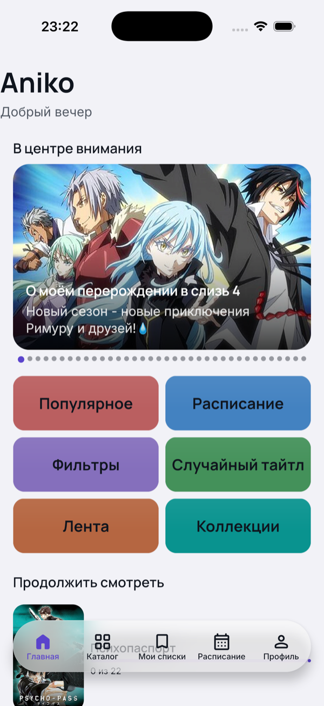
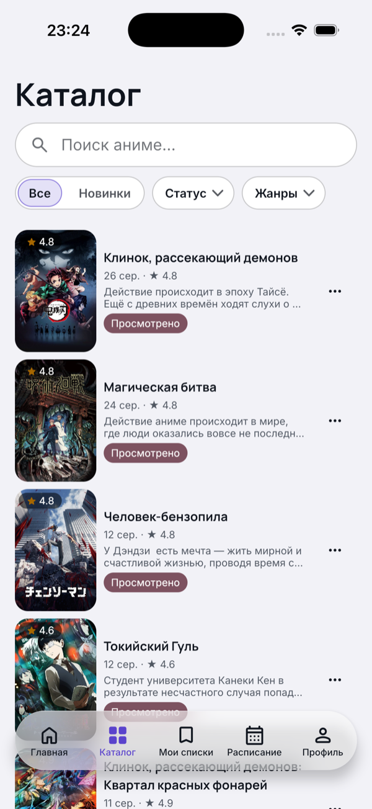
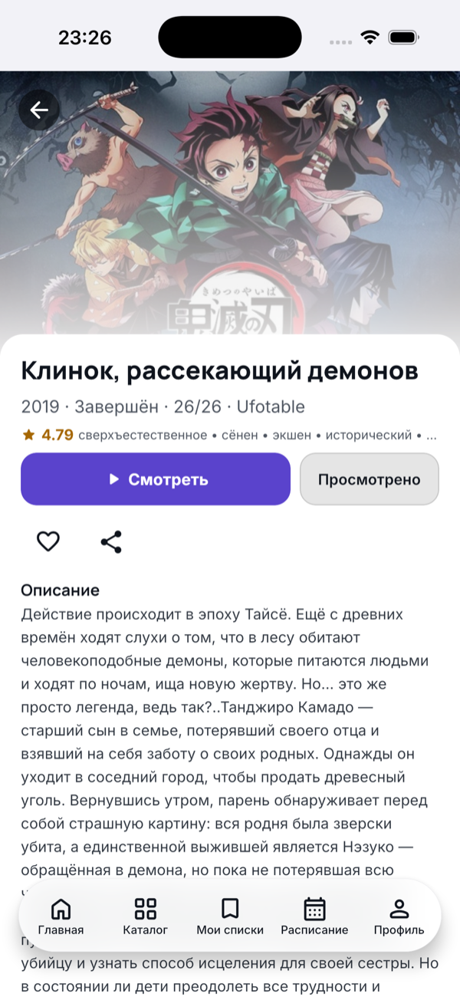
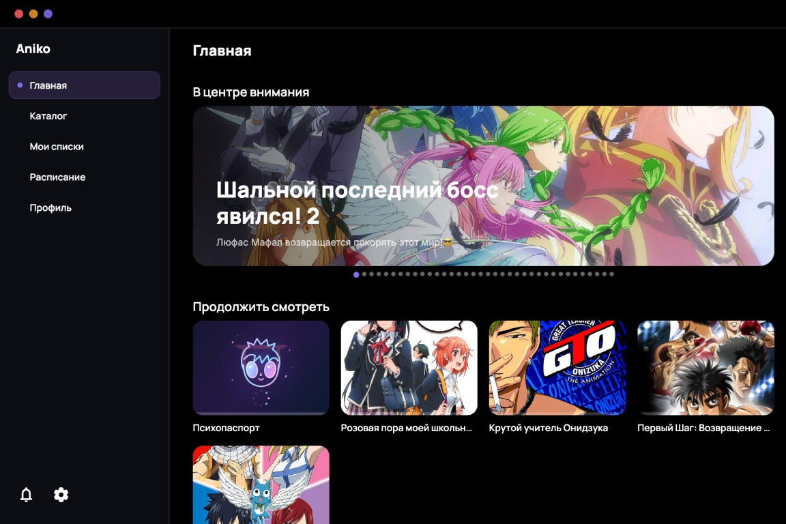
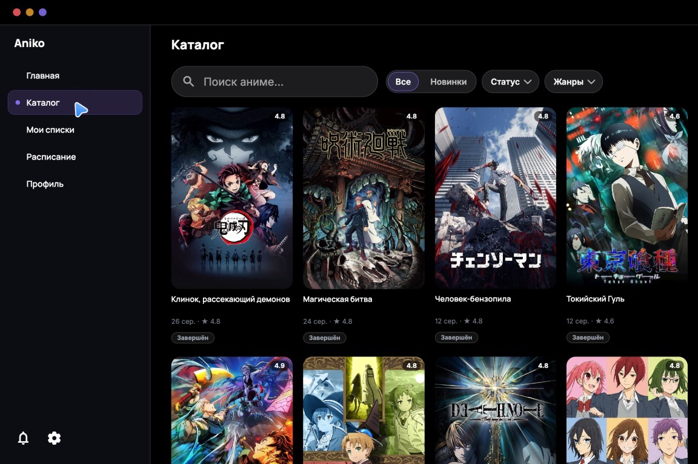
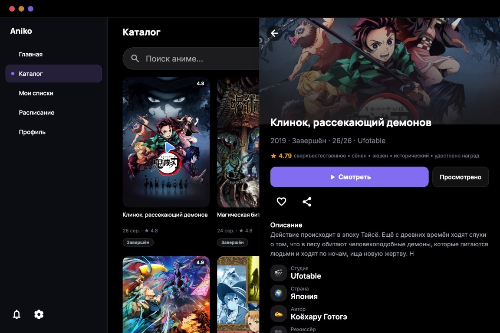
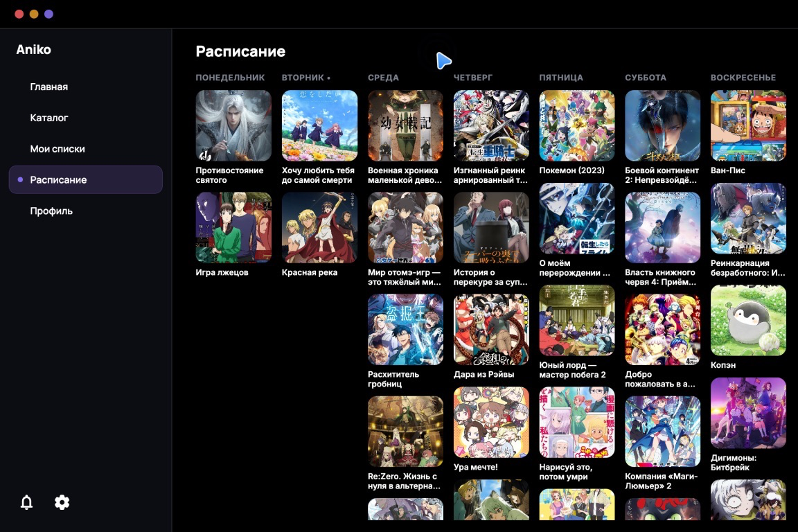
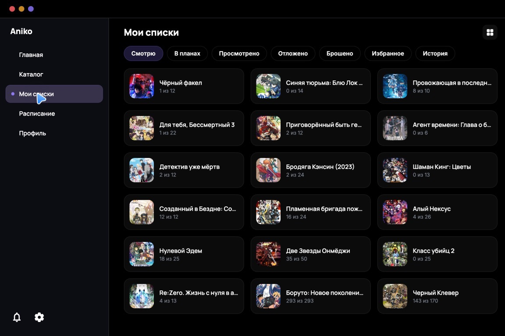

<p align="center">
  
</p>

<h1 align="center">Aniko</h1>

<p align="center">
  Неофициальный мультиплатформенный клиент <a href="https://anixart.tv">Anixart</a><br/>
  Kotlin Multiplatform + Compose Multiplatform · единая кодовая база
</p>

<p align="center">
  
  
  
</p>

<p align="center">
  <b>🇷🇺 Русский</b> · <a href="README_EN.md">🇬🇧 English</a>
</p>

---

> **Проект изначально делался ради iOS-версии.** Официального клиента Anixart для iPhone не существует —
> Aniko закрывает именно эту потребность, и автор ежедневно пользуется им на своём iPhone. Удобный способ
> доставки iOS-сборки всем желающим пока в процессе придумывания (сейчас — side-load со своим Apple ID,
> см. «[Установка](#-установка)»), но сама iOS-версия полностью рабочая. Android и Desktop получились
> «попутно» благодаря единой кодовой базе — и это полноценные клиенты, а не заглушки.

> [!NOTE]
> **Статус: альфа (`v0.0.2`).** Проект в активной разработке: часть функций Anixart ещё не реализована
> (см. «что уже реализовано» в [`docs/api/ANIXART_API.md`](docs/api/ANIXART_API.md)), возможны баги,
> ломающие изменения и потеря локальных данных между версиями.

## 📸 Скриншоты

**iOS (iPhone)**

| Главная | Каталог | Карточка релиза |
|---|---|---|
|  |  |  |

**Desktop (macOS)**

| Главная | Каталог | Карточка релиза |
|---|---|---|
|  |  |  |

| Расписание | Мои списки |
|---|---|
|  |  |

## ✨ Возможности

- **Каталог и поиск** — фильтры по жанрам, году, статусу, типу; вкладки «Все / Новинки»
- **Карточка релиза** — описание, жанры, гистограмма оценок, related-тайтлы, комментарии, голосование
- **Плеер** — выбор озвучки и источника, resume-диалог, жесты перемотки, смена качества (Desktop),
  PiP (Android)
- **Мои списки** — смотрю / в планах / просмотрено / отложено / брошено, избранное, история просмотра
- **Профиль** — статистика просмотра, графики активности, достижения, настройки приватности
- **Синхронизация** — с официальным аккаунтом Anixart (тот же токен, что и в оригинальном приложении),
  офлайн-очередь действий, фоновые уведомления о новых сериях
- **Платформенная адаптивность** — адаптивные раскладки phone / tablet / desktop, темы, RU/EN

## 🛠 Технологии

| | |
|---|---|
| **Язык / UI** | Kotlin Multiplatform, Compose Multiplatform (Android · iOS · Desktop) |
| **Сеть** | Ktor, kotlinx.serialization |
| **DI / хранение** | Koin, SQLDelight, Multiplatform Settings |
| **Изображения** | Coil |

| Модуль | Назначение |
|---|---|
| `shared:model` | Общие доменные модели |
| `shared:network` | HTTP-клиент, конфигурация API, обработка ошибок |
| `shared:data` | Репозитории, DTO, API-интерфейсы (`shared/data/.../api`) |
| `shared:player` | Проигрыватель видео (embed/iframe-источники) |
| `shared:ui` | Общие компоненты, тема, i18n, работа с изображениями |
| `composeApp` | Точки входа платформ (Android / iOS-framework / Desktop), экраны и навигация |

Полное описание API Anixart (эндпоинты, модели, аутентификация) — в
[`docs/api/ANIXART_API.md`](docs/api/ANIXART_API.md).

## 📦 Установка

### Android

1. Скачайте `.apk` со страницы [Releases](https://github.com/ArkHak/Aniko/releases).
2. Разрешите установку из неизвестных источников (Настройки → Приложения → Особый доступ →
   Установка неизвестных приложений — для браузера/файлового менеджера, которым открываете APK).
3. Откройте скачанный `.apk` и установите.

Аккаунт разработчика/Google Play не требуется — Android разрешает устанавливать подписанные любым
ключом APK напрямую.

### iOS (iPhone) — без платного Apple Developer

Apple **всегда** требует подписи приложения каким-либо Apple ID, даже для side-load — это ограничение
iOS. «Без аккаунта разработчика» означает **без платной подписки Apple Developer Program (99 $/год)**:
достаточно обычного бесплатного Apple ID (того же, что для iCloud/App Store). Его ограничения:
сертификат действует **7 дней** (затем нужна переподпись), лимит одновременно подписанных приложений.

<details>
<summary><b>Способ 1. Прямая установка через Xcode</b> — проще всего, но телефон нужно периодически подключать к Mac</summary>

Требования: Mac с Xcode, бесплатный Apple ID, кабель (или Wi-Fi debugging).

1. Установите [Xcode](https://apps.apple.com/app/xcode/id497799835) из App Store.
2. Xcode → Settings → Accounts → добавьте свой Apple ID (платная подписка не нужна).
3. Склонируйте репозиторий, откройте `iosApp/iosApp.xcodeproj`.
4. В `iosApp/Configuration/Config.xcconfig` укажите `TEAM_ID` вашей персональной команды
   (Xcode → Settings → Accounts → ваш Apple ID → `<Ваше имя> (Personal Team)`; Team ID виден через
   «Manage Certificates» или в Signing & Capabilities таргета `iosApp` после выбора команды).
   `CODE_SIGN_STYLE` уже выставлен в `Automatic`.
5. Подключите iPhone кабелем (либо один раз кабелем, затем Xcode → Window → Devices and Simulators →
   «Connect via network»).
6. На iPhone: Настройки → Конфиденциальность и безопасность → Режим разработчика → включить →
   перезагрузить (iOS 16+).
7. В Xcode выберите ваш iPhone и нажмите ▶ Run. Gradle-сборка общего фреймворка запустится
   автоматически (build phase `embedAndSignAppleFrameworkForXcode`) — при первой сборке это займёт
   несколько минут.
8. При первом запуске появится «Untrusted Developer»: Настройки → Основные → VPN и управление
   устройством → выберите свой Apple ID → «Доверять».
9. Через 7 дней сертификат истечёт («Не удаётся проверить приложение») — подключите телефон и
   повторите шаг 7; локальные данные при этом не теряются.
</details>

<details>
<summary><b>Способ 2. AltStore / SideStore</b> — side-load без кабеля при каждом запуске</summary>

Подходит, если не хочется каждую неделю подключать телефон к Mac. Компьютер (Mac/Windows) всё равно
нужен для первичной установки и фонового продления подписи по Wi-Fi.

1. Возьмите готовый неподписанный `.ipa` со страницы [Releases](https://github.com/ArkHak/Aniko/releases)
   (`aniko-v0.0.2-ios-unsigned.ipa`) либо соберите сами: в Xcode (после настройки `TEAM_ID`, как в
   Способе 1) Product → Archive для реального устройства → Distribute App → Development →
   экспортируйте `.ipa`.
2. Установите [AltServer](https://altstore.io/) (или [SideStore](https://sidestore.io/) — более гибкий
   форк) на компьютер и авторизуйтесь тем же бесплатным Apple ID.
3. Через AltServer установите AltStore/SideStore на iPhone (первый раз — по кабелю), в Настройках
   iPhone подтвердите доверие разработчику.
4. В AltStore на iPhone нажмите «+» и выберите `.ipa` — он будет подписан вашим Apple ID и установлен.
5. Пока компьютер с AltServer доступен в той же Wi-Fi сети, подпись будет продлеваться автоматически.
</details>

> Оба способа ограничены политикой Apple для бесплатных Apple ID (7-дневная подпись, лимит App ID) —
> это системное ограничение iOS, обойти его без платного Apple Developer Program (или джейлбрейка)
> нельзя.

### macOS (Desktop)

Скачайте `aniko-v0.0.2-macos.dmg` со страницы [Releases](https://github.com/ArkHak/Aniko/releases),
откройте и перетащите `Aniko.app` в `Applications`.

Приложение собрано без платного Apple Developer Program: оно подписано ad-hoc (без сертификата
Developer ID) и не проходило нотаризацию Apple. Поэтому при первом запуске скачанного из интернета
приложения Gatekeeper заблокирует его с сообщением «приложение повреждено» или «не может быть
открыто». Это ожидаемо — обойти блокировку можно любым из способов ниже:

**Способ 1. Через «Открыть» (ПКМ)**

1. В Finder найдите `Aniko.app` в папке `Applications`.
2. Кликните правой кнопкой (или Ctrl+клик) по иконке → «Открыть».
3. В диалоге снова нажмите «Открыть». Предупреждение показывается один раз, дальше приложение
   запускается обычным двойным кликом.

**Способ 2. Через Настройки**

1. Попробуйте запустить приложение обычным способом — получите отказ.
2. Откройте Настройки → Конфиденциальность и безопасность, прокрутите вниз до пункта про
   «Aniko» и нажмите «Открыть в любом случае».

**Способ 3. Через Терминал (снять карантин)**

```bash
xattr -dr com.apple.quarantine /Applications/Aniko.app
```

Если не доверяете сборке из Releases — соберите `.dmg` из исходников самостоятельно, см.
«[Сборка из исходников](#-сборка-из-исходников)»: собранное локально приложение не получает
атрибут карантина и запускается без этих шагов.

## 🔧 Сборка из исходников

Требования: JDK 17+, Android SDK (для Android-таргета), Xcode (для iOS-таргета, только на macOS).

```bash
# Android — debug APK
./gradlew :composeApp:assembleDebug
# результат: composeApp/build/outputs/apk/debug/composeApp-debug.apk

# Desktop (macOS) — DMG
./gradlew :composeApp:packageDmg

# iOS — открыть в Xcode
open iosApp/iosApp.xcodeproj
```

<details>
<summary><b>Релизная подпись Android</b> (<code>assembleRelease</code> / <code>bundleRelease</code>)</summary>

`assembleDebug` подписи не требует (AGP генерирует debug-keystore). Для релиза нужен собственный
ключ — репозиторий его не содержит (см. `.gitignore`: `*.jks`, `keystore.properties`):

```bash
cp keystore.properties.example keystore.properties
keytool -genkeypair -v -keystore composeApp/release/aniko-release.jks \
  -alias aniko-release -keyalg RSA -keysize 2048 -validity 10000
# заполните storePassword/keyPassword в keystore.properties
# (PKCS12 требует storePassword == keyPassword)

./gradlew :composeApp:assembleRelease
# результат: composeApp/build/outputs/apk/release/composeApp-release.apk
```

Без `keystore.properties` (или переменных окружения `ANIKO_KEYSTORE_PATH` / `ANIKO_KEYSTORE_PASSWORD` /
`ANIKO_KEY_ALIAS` / `ANIKO_KEY_PASSWORD` — используются в CI) релизная сборка падает на этапе подписи,
а не собирается неподписанной.
</details>

## 📚 Документация

- [`docs/api/ANIXART_API.md`](docs/api/ANIXART_API.md) — полное описание используемого API Anixart
  (эндпоинты, модели, аутентификация, живые сэмплы ответов)
- [`docs/REELWAVE_PLAN.md`](docs/REELWAVE_PLAN.md) — трекер разработки: статусы фаз, ключевые решения,
  техдолг, оставшиеся задачи
- [`AGENTS.md`](AGENTS.md) — правила работы в репозитории для агентов и контрибьюторов
  (git-флоу, конвенции кода, валидация)

## ⚖️ Правовая информация

- **Права на контент.** Aniko — только клиентский интерфейс к сервису Anixart: приложение не хранит,
  не производит и не распространяет аудиовизуальные произведения. Весь контент (видео, изображения,
  описания) загружается с серверов Anixart и сторонних видеохостингов и принадлежит соответствующим
  правообладателям (ст. 1255, 1270 ГК РФ). Ответственность за соблюдение авторских прав при просмотре
  несёт пользователь.
- **Права на сервис и товарные знаки.** Anixart и связанные с ним названия и логотипы принадлежат их
  правообладателям. Проект Aniko не аффилирован с ними и не выдаёт себя за официальный клиент.
- **Исследование API.** Описание протокола в [`docs/api/ANIXART_API.md`](docs/api/ANIXART_API.md)
  получено путём изучения взаимодействия приложения с сервисом в исследовательских целях, в том числе
  для обеспечения совместимости (ср. ст. 1280 ГК РФ), и опубликовано как техническая документация, а
  не как инструкция по несанкционированному доступу.
- **Без обхода ограничений.** Приложение не содержит VPN, прокси или иных средств обхода блокировок и
  не предназначено для доступа к информации, распространение которой ограничено на территории РФ
  (ст. 15.1–15.8 Федерального закона № 149-ФЗ «Об информации, информационных технологиях и о защите
  информации»). Упоминаемая в документации API цепочка резервных адресов — свойство оригинального
  сервиса Anixart; в Aniko она не реализована.
- **Возрастные ограничения.** Возрастные рейтинги отображаются в том виде, в каком их предоставляет
  сервис Anixart. Пользователь обязан самостоятельно соблюдать требования Федерального закона
  № 436-ФЗ «О защите детей от информации, причиняющей вред их здоровью и развитию».
- **Персональные данные.** Учётные данные и токен сессии хранятся локально на устройстве пользователя
  и передаются только на серверы Anixart. Разработчик Aniko не собирает и не обрабатывает персональные
  данные пользователей и не является их оператором (Федеральный закон № 152-ФЗ «О персональных
  данных»).

## 📄 Лицензия

Лицензия не определена. Код опубликован для личного/исследовательского использования; вопросы по
распространению — к автору репозитория.

---

<p align="center">
  <sub>Aniko — независимый проект, не аффилированный с Anixart. Сделано в исследовательских и личных целях.</sub>
</p>
