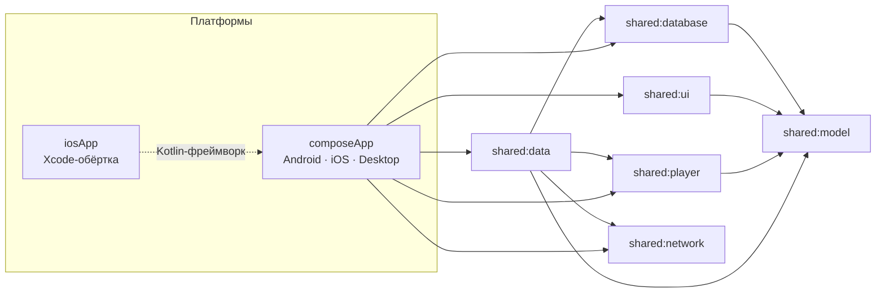

<div align="center">


# Aniko

**Неофициальный мультиплатформенный клиент [Anixart](https://anixart.tv)**<br/>
для iPhone, Android и Mac — одна кодовая база на Kotlin Multiplatform

<br/>

[](https://github.com/ArkHak/Aniko-app/releases/tag/v0.1.0)
[](LICENSE)
[](#-скачать)
[](https://kotlinlang.org)
[](https://github.com/ArkHak/Aniko-app/actions/workflows/ci.yml)

**🇷🇺 Русский** · [🇬🇧 English](README_EN.md)

[**Скачать**](#-скачать) · [Возможности](#-возможности) · [Установка](#-установка) · [Частые вопросы](#-частые-вопросы) · [Сборка](#-сборка-из-исходников)

</div>

<div align="center">
  
</div>

---

> **Проект изначально делался ради iOS.** Официального клиента Anixart для iPhone не существует —
> Aniko закрывает именно эту потребность. Android и Desktop получились «попутно» благодаря общей
> кодовой базе, и это полноценные клиенты, а не заглушки.

> [!NOTE]
> **Статус: ранний публичный релиз (v0.1.0).** Приложением можно пользоваться каждый день, но проект
> активно развивается: возможны баги, часть функций Anixart ещё не реализована, а формат локальных
> данных между версиями может меняться.

## 📥 Скачать

Готовые сборки — на странице [**Releases**](https://github.com/ArkHak/Aniko-app/releases).

| Платформа | Файл | Размер | Требования | Как поставить |
|---|---|---|---|---|
| 🤖 **Android** | `aniko-v0.1.0-android.apk` | 4,6 МБ | Android 8.0+ (API 26) | [инструкция](#-android) |
| 🍎 **iPhone / iPad** | `aniko-v0.1.0-ios-unsigned.ipa` | 16 МБ | iOS 15+ | [инструкция](#-iphone-без-платного-apple-developer) |
| 💻 **macOS** | `aniko-v0.1.0-macos.dmg` | 172 МБ | Mac на Apple Silicon (M1 и новее) + [VLC](https://www.videolan.org/vlc/) | [инструкция](#-macos) |

> Приложение бесплатное и без рекламы. Для входа нужен аккаунт Anixart (его можно создать прямо в приложении).

## 📸 Скриншоты

<div align="center">

**iPhone**

| Главная | Каталог | Карточка релиза |
|:---:|:---:|:---:|
|  |  |  |

**macOS**

| Главная | Каталог | Карточка релиза |
|:---:|:---:|:---:|
|  |  |  |

| Расписание | Мои списки |
|:---:|:---:|
|  |  |

</div>

## ✨ Возможности

<table>
<tr>
<td width="50%" valign="top">

### 🔎 Каталог и поиск
- Вкладки «Аниме» / «Дунхуа», «Все» / «Новинки»
- Поиск и фильтры: жанры, год, статус, тип
- Расписание выхода серий по дням недели
- Ленты, коллекции, «Обсуждаемое», «Новые серии»

### 🎬 Просмотр
- Выбор озвучки и источника, закреплённые («любимые») озвучки
- Память озвучки для каждого тайтла
- Диалог «продолжить с места», перемотка ±10 / −30 сек, жесты
- Качество по умолчанию и плавное переключение (Desktop)
- Picture-in-Picture (Android)
- Для лицензированных в вашей стране тайтлов — ссылки на легальные платформы

</td>
<td width="50%" valign="top">

### 📚 Библиотека
- Списки: смотрю · в планах · просмотрено · отложено · брошено
- Избранное и история просмотра, вид «список / сетка»
- Оптимистичная запись + офлайн-очередь: без сети изменения копятся и уходят сами

### 👤 Профиль и сообщество
- Статистика просмотра, график активности, любимые жанры, полученные значки
- Комментарии: писать, голосовать, отвечать
- Уведомления с бейджем непрочитанных

### 🎨 Интерфейс
- Дизайн в духе iOS HIG с материалом Liquid Glass
- Адаптивные раскладки: телефон · планшет · desktop
- Светлая, тёмная и AMOLED-темы, RU / EN
- Ссылки `aniko://release/…` для открытия релиза и серии

</td>
</tr>
</table>

**Аккаунт и данные.** Вход и синхронизация идут через официальный аккаунт Anixart: списки, история
и прогресс совпадают с тем, что вы видите в оригинальном приложении. Токен сессии хранится только на
устройстве (Keychain на iOS/macOS, шифрованное хранилище на Android).

**Чего пока нет.** Мгновенных push-уведомлений (новые серии приходят через периодический опрос)
и каталога достижений (показываются только уже полученные значки), а качество/субтитры/аудиодорожка недоступны там, где видео открывается во встроенной
странице стороннего плеера (Android и iOS).

## 📦 Установка

### 🤖 Android

1. Скачайте `aniko-v0.1.0-android.apk` со страницы [Releases](https://github.com/ArkHak/Aniko-app/releases).
2. Разрешите установку из неизвестных источников для приложения, которым открываете файл (браузер
   или менеджер файлов): *Настройки → Приложения → Особый доступ → Установка неизвестных приложений*.
3. Откройте APK и подтвердите установку. Если Google Play Protect предупредит о неизвестном
   разработчике — выберите «Всё равно установить»: сборка подписана собственным ключом проекта, а не
   ключом Google Play.

> [!IMPORTANT]
> Версии `v0.0.x` были подписаны debug-ключом. Релизная сборка `0.1.0` подписана другим ключом,
> поэтому **старую Aniko нужно удалить** перед установкой (Android не позволяет обновить приложение
> поверх сборки с другой подписью). Данные аккаунта не потеряются — они лежат на серверах Anixart.

### 🍎 iPhone без платного Apple Developer

Apple требует подпись для *любого* приложения вне App Store. «Без аккаунта разработчика» здесь значит
**без платной подписки Apple Developer Program (99 $/год)**: достаточно обычного бесплатного Apple ID.
Цена бесплатного варианта — сертификат живёт **7 дней**, потом приложение нужно переподписать
(данные при этом сохраняются). Выберите один из способов:

<details>
<summary><b>Способ 1. Xcode</b> — без сторонних инструментов (нужен Mac)</summary>

<br/>

1. Установите [Xcode](https://apps.apple.com/app/xcode/id497799835) и добавьте свой Apple ID:
   *Xcode → Settings → Accounts → «+»*.
2. Клонируйте репозиторий и откройте проект:
   ```bash
   git clone https://github.com/ArkHak/Aniko-app.git Aniko
   open Aniko/iosApp/iosApp.xcodeproj
   ```
3. В `iosApp/Configuration/Config.xcconfig` впишите свой Team ID (`TEAM_ID=XXXXXXXXXX`). Его видно
   в *Xcode → Settings → Accounts → ваш Apple ID → Personal Team* или во вкладке *Signing &
   Capabilities* таргета `iosApp`. Не коммитьте это значение.
4. Включите на iPhone *Настройки → Конфиденциальность и безопасность → Режим разработчика*
   (потребуется перезагрузка, iOS 16+) и подключите телефон кабелем.
5. Выберите iPhone в Xcode и нажмите ▶ **Run**. Первая сборка Kotlin/Native занимает несколько минут.
6. При первом запуске: *Настройки → Основные → VPN и управление устройством →* ваш Apple ID → **Доверять**.
7. Через 7 дней подключите телефон и повторите шаг 5 — локальные данные сохранятся.

</details>

<details>
<summary><b>Способ 2. AltStore / SideStore</b> — готовый .ipa, продление подписи по Wi-Fi</summary>

<br/>

1. Скачайте `aniko-v0.1.0-ios-unsigned.ipa` со страницы [Releases](https://github.com/ArkHak/Aniko-app/releases)
   на iPhone (или перенесите файл на него).
2. Установите [AltServer](https://altstore.io/) (Mac/Windows) или [SideStore](https://sidestore.io/) и
   войдите своим бесплатным Apple ID.
3. Поставьте AltStore/SideStore на iPhone (первый раз — по кабелю) и подтвердите доверие
   разработчику в настройках iPhone.
4. В AltStore нажмите «+» и выберите `.ipa` — он подпишется вашим Apple ID и установится.
5. Пока компьютер с AltServer в той же Wi-Fi сети, подпись продлевается автоматически.

</details>

<details>
<summary><b>Способ 3. Sideloadly</b> — графический установщик (Mac/Windows)</summary>

<br/>

1. Скачайте [Sideloadly](https://sideloadly.io/) и подключите iPhone кабелем.
2. Перетащите `aniko-v0.1.0-ios-unsigned.ipa` в окно, укажите бесплатный Apple ID и нажмите **Start**.
3. Доверьте разработчику: *Настройки → Основные → VPN и управление устройством*.
4. Раз в 7 дней повторяйте установку, чтобы продлить подпись.

</details>

> Ограничения бесплатного Apple ID (7 дней, лимит одновременно подписанных приложений) — политика
> Apple. Обойти их без платной программы или джейлбрейка нельзя.

### 💻 macOS

1. Скачайте `aniko-v0.1.0-macos.dmg`, откройте его и перетащите **Aniko** в папку *Программы*.
2. Установите [VLC](https://www.videolan.org/vlc/) в `/Applications` — Aniko использует его библиотеки
   для воспроизведения видео. Версия VLC должна соответствовать архитектуре Mac (Apple Silicon).
3. Запустите Aniko. Сборка подписана ad-hoc и не нотаризована Apple, поэтому Gatekeeper при первом
   запуске откажет («приложение повреждено» или «не удалось проверить разработчика»). Любой из способов:

   - **Правый клик → «Открыть»** по `Aniko.app` и ещё раз «Открыть» в диалоге (нужно один раз).
   - **Параметры системы → Конфиденциальность и безопасность** → «Всё равно открыть» рядом с Aniko.
   - **Терминал** — снять карантин:
     ```bash
     xattr -dr com.apple.quarantine /Applications/Aniko.app
     ```

Не доверяете готовой сборке? Соберите приложение сами — [это несложно](#-сборка-из-исходников), а
локально собранное приложение карантин не получает.

**Windows и Linux** готовых сборок не имеют. Desktop-версию можно запустить из исходников
(`./gradlew :composeApp:run`), но платформа не тестировалась.

### 🚀 Первый запуск

Aniko откроет экран входа. Введите логин и пароль от аккаунта Anixart либо нажмите
«Регистрация» — создание аккаунта (с подтверждением по коду из письма) встроено в приложение. Без
входа приложение не работает: каталог и профиль привязаны к аккаунту.

## ❓ Частые вопросы

<details>
<summary><b>macOS пишет «Aniko повреждено» и предлагает в корзину</b></summary>

Это Gatekeeper: приложение не нотаризовано Apple. Выполните
`xattr -dr com.apple.quarantine /Applications/Aniko.app` или используйте «Открыть» по правому клику.
</details>

<details>
<summary><b>На Mac открывается интерфейс, но видео не играет</b></summary>

Убедитесь, что VLC установлен в `/Applications` и его архитектура совпадает с процессором вашего Mac
(Apple Silicon → сборка VLC для arm64 или universal).
</details>

<details>
<summary><b>На iPhone «Не удаётся проверить приложение» / приложение не запускается</b></summary>

Истекла 7-дневная подпись бесплатного Apple ID. Переподпишите приложение (Xcode, AltStore или
Sideloadly) — данные сохранятся. Убедитесь также, что включён «Режим разработчика».
</details>

<details>
<summary><b>Android не даёт установить APK</b></summary>

Разрешите установку из неизвестных источников для приложения, через которое открываете файл. Если
Aniko уже стоит и подписана другим ключом — сначала удалите её (см. примечание в разделе Android).
</details>

<details>
<summary><b>Не нажимается «Смотреть», вместо серий — список платформ</b></summary>

Правообладатель лицензировал тайтл на территории вашей страны, поэтому воспроизведение внутри
приложения отключено (как и в официальном клиенте). Aniko показывает ссылки на легальные платформы.
</details>

<details>
<summary><b>Не загружается каталог</b></summary>

Проверьте интернет и доступность сервиса Anixart с вашей сети. Aniko не содержит VPN, прокси и
средств обхода блокировок (см. [правовую информацию](#-правовая-информация)).
</details>

## 🔧 Сборка из исходников

Требования: **JDK 17+**, Android SDK (для Android), **Xcode** (для iOS, только на macOS).
Gradle подтягивается автоматически (`./gradlew`).

```bash
# Android — debug APK
./gradlew :composeApp:assembleDebug
#   → composeApp/build/outputs/apk/debug/composeApp-debug.apk

# Desktop — запуск и DMG (macOS)
./gradlew :composeApp:run
./gradlew :composeApp:packageDmg
#   → composeApp/build/compose/binaries/main/dmg/

# iOS — открыть проект в Xcode (Gradle соберёт фреймворк автоматически)
open iosApp/iosApp.xcodeproj
```

<details>
<summary><b>Релизная подпись Android</b> (<code>assembleRelease</code>)</summary>

<br/>

Репозиторий не содержит ключей (см. `.gitignore`: `*.jks`, `keystore.properties`). Создайте свой:

```bash
cp keystore.properties.example keystore.properties
keytool -genkeypair -v -keystore composeApp/release/aniko-release.jks \
  -alias aniko-release -keyalg RSA -keysize 2048 -validity 10000
# заполните storePassword / keyPassword в keystore.properties
# (для PKCS12 они должны совпадать)

./gradlew :composeApp:assembleRelease
#   → composeApp/build/outputs/apk/release/composeApp-release.apk
```

В CI можно передать ключ переменными окружения `ANIKO_KEYSTORE_PATH`, `ANIKO_KEYSTORE_PASSWORD`,
`ANIKO_KEY_ALIAS`, `ANIKO_KEY_PASSWORD`. Без ключа релизная сборка падает на подписи — намеренно, а не
выпускается неподписанной.

</details>

<details>
<summary><b>Неподписанный .ipa для AltStore / SideStore</b></summary>

<br/>

```bash
xcodebuild archive -project iosApp/iosApp.xcodeproj -scheme iosApp -configuration Release \
  -archivePath build/Aniko.xcarchive -destination 'generic/platform=iOS' \
  CODE_SIGNING_ALLOWED=NO CODE_SIGNING_REQUIRED=NO CODE_SIGN_IDENTITY="" DEVELOPMENT_TEAM=""
mkdir -p Payload && cp -R build/Aniko.xcarchive/Products/Applications/Aniko.app Payload/
zip -qr Aniko-unsigned.ipa Payload
```

</details>

## 🏗 Архитектура



| Слой | Что внутри |
|---|---|
| `shared:model` | Доменные модели |
| `shared:network` | HTTP-клиент, конфигурация API, типизированные ошибки |
| `shared:data` | Репозитории, DTO, API-интерфейсы, офлайн-очередь и синхронизация |
| `shared:database` | SQLDelight: TTL-кэш, членство в списках, прогресс серий |
| `shared:player` | Плеер: WebView-мост (Android/iOS) и VLC-рендер (Desktop) |
| `shared:ui` | Дизайн-система, компоненты, темы, RU/EN i18n |
| `composeApp` | Экраны, навигация, MVI-ViewModel, точки входа платформ |
| `detekt-rules` | Кастомные правила линтера (например, запрет кириллицы вне i18n) |

**Стек:** Kotlin 2.4 · Compose Multiplatform 1.11 · Ktor 3.5 · Koin 4.2 · SQLDelight 2.3 · Coil 3.5 ·
vlcj 4.11 (Desktop). Архитектура экранов — MVI (`BaseViewModel<State, Intent, Effect>`).

Полное описание используемого API Anixart (эндпоинты, модели, авторизация) —
[`docs/api/ANIXART_API.md`](docs/api/ANIXART_API.md).

## ✅ Тесты и качество

```bash
./gradlew ktlintCheck detektMetadataCommonMain detektDesktopMain   # линтеры
./gradlew :composeApp:desktopTest :shared:data:desktopTest         # тесты
```

В репозитории есть контрактные тесты на сэмплах ответов API, UI smoke-тесты на Desktop, аудиты
доступности (контраст WCAG AA, `contentDescription`, масштаб шрифта 200%) и проверка на TalkBack.
Проверка на VoiceOver (iOS) пока не завершена — см. Roadmap.

## 🗺 Roadmap

- [ ] Проход VoiceOver на iOS (последний пункт аудита доступности)
- [ ] Пометка «устаревшие данные» при работе из офлайн-кэша
- [ ] Полная Xcode-сборка iOS в CI
- [ ] Более удобная доставка iOS-сборки (сейчас — только side-load)

Подробный трекер — [`docs/REELWAVE_PLAN.md`](docs/REELWAVE_PLAN.md).

## 🤝 Участие в разработке

Issues и Pull Request'ы приветствуются. Правила ветвления, коммитов и проверок —
в [`CONTRIBUTING.md`](CONTRIBUTING.md) и [`AGENTS.md`](AGENTS.md). Если собираетесь делать крупную
фичу — сначала откройте issue, чтобы обсудить подход.

## 📜 Правовая информация

- **Права на контент.** Aniko — только клиентский интерфейс к сервису Anixart: приложение не хранит,
  не производит и не распространяет аудиовизуальные произведения. Весь контент (видео, изображения,
  описания) загружается с серверов Anixart и сторонних видеохостингов и принадлежит соответствующим
  правообладателям (ст. 1255, 1270 ГК РФ). Ответственность за соблюдение авторских прав при просмотре
  несёт пользователь.
- **Права на сервис и товарные знаки.** Anixart и связанные с ним названия и логотипы принадлежат их
  правообладателям. Проект Aniko не аффилирован с ними и не выдаёт себя за официальный клиент.
- **Исследование API.** Описание протокола в [`docs/api/ANIXART_API.md`](docs/api/ANIXART_API.md)
  получено путём изучения взаимодействия приложения с сервисом в исследовательских целях, в том числе
  для обеспечения совместимости (ср. ст. 1280 ГК РФ), и опубликовано как техническая документация, а
  не как инструкция по несанкционированному доступу.
- **Без обхода ограничений.** Приложение не содержит VPN, прокси или иных средств обхода блокировок и
  не предназначено для доступа к информации, распространение которой ограничено на территории РФ
  (ст. 15.1–15.8 Федерального закона № 149-ФЗ «Об информации, информационных технологиях и о защите
  информации»). Упоминаемая в документации API цепочка резервных адресов — свойство оригинального
  сервиса Anixart; в Aniko она не реализована.
- **Возрастные ограничения.** Возрастные рейтинги отображаются в том виде, в каком их предоставляет
  сервис Anixart. Пользователь обязан самостоятельно соблюдать требования Федерального закона
  № 436-ФЗ «О защите детей от информации, причиняющей вред их здоровью и развитию».
- **Персональные данные.** Учётные данные и токен сессии хранятся локально на устройстве пользователя
  и передаются только на серверы Anixart. Разработчик Aniko не собирает и не обрабатывает персональные
  данные пользователей и не является их оператором (Федеральный закон № 152-ФЗ «О персональных
  данных»).

## 📄 Лицензия

Код распространяется по лицензии **[GNU GPL v3.0](LICENSE)**. Desktop-версия использует
[vlcj](https://github.com/caprica/vlcj) (GPL-3.0) и библиотеки [VLC](https://www.videolan.org/vlc/)
(LGPL-2.1+), поэтому проект целиком открыт под GPL-3.0. Остальные зависимости — под Apache-2.0
и другими совместимыми лицензиями. Copyright © 2026 ArkHak и контрибьюторы Aniko.

## 🙏 Благодарности

[Anixart](https://anixart.tv) — за сервис и контент · [JetBrains](https://www.jetbrains.com) — за Kotlin и
Compose Multiplatform · [VLC](https://www.videolan.org/vlc/) и [vlcj](https://github.com/caprica/vlcj) —
за плеер на Desktop · [AltStore](https://altstore.io/) и [SideStore](https://sidestore.io/) — за
возможность ставить приложения на iPhone без платной подписки.

---

<div align="center">
  <sub>Aniko — независимый проект, не аффилированный с Anixart. Сделано в исследовательских и личных целях.</sub>
</div>
