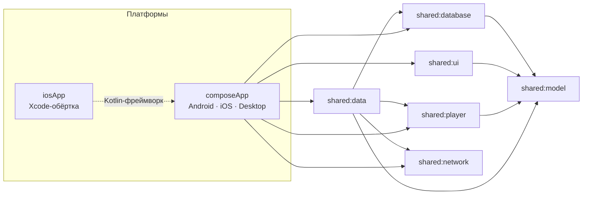

# Разработка Aniko

Эта страница — для тех, кто хочет собрать Aniko из исходников или разобраться в устройстве проекта.
Если вы просто хотите пользоваться приложением, вам нужен [README](../README.md).

Правила работы с кодом (git-флоу, конвенции, проверки) — в [`AGENTS.md`](../AGENTS.md). Описание используемого API Anixart — в [`docs/api/ANIXART_API.md`](api/ANIXART_API.md).

## Сборка из исходников

Требования: **JDK 17+**, Android SDK (для Android), **Xcode** (для iOS, только на macOS).
Gradle подтягивается автоматически (`./gradlew`).

```bash
# Android — debug APK
./gradlew :composeApp:assembleDebug
#   → composeApp/build/outputs/apk/debug/composeApp-debug.apk

# Desktop — запуск и DMG (macOS)
./gradlew :composeApp:run
./gradlew :composeApp:packageDmg
#   → composeApp/build/compose/binaries/main/dmg/

# iOS — открыть проект в Xcode (Gradle соберёт фреймворк автоматически)
open iosApp/iosApp.xcodeproj
```

<details>
<summary><b>Релизная подпись Android</b> (<code>assembleRelease</code>)</summary>

<br/>

Репозиторий не содержит ключей (см. `.gitignore`: `*.jks`, `keystore.properties`). Создайте свой:

```bash
cp keystore.properties.example keystore.properties
keytool -genkeypair -v -keystore composeApp/release/aniko-release.jks \
  -alias aniko-release -keyalg RSA -keysize 2048 -validity 10000
# заполните storePassword / keyPassword в keystore.properties
# (для PKCS12 они должны совпадать)

./gradlew :composeApp:assembleRelease
#   → composeApp/build/outputs/apk/release/composeApp-release.apk
```

В CI можно передать ключ переменными окружения `ANIKO_KEYSTORE_PATH`, `ANIKO_KEYSTORE_PASSWORD`,
`ANIKO_KEY_ALIAS`, `ANIKO_KEY_PASSWORD`. Без ключа релизная сборка падает на подписи — намеренно, а не
выпускается неподписанной.

</details>

<details>
<summary><b>Неподписанный .ipa для AltStore / SideStore</b></summary>

<br/>

```bash
xcodebuild archive -project iosApp/iosApp.xcodeproj -scheme iosApp -configuration Release \
  -archivePath build/Aniko.xcarchive -destination 'generic/platform=iOS' \
  CODE_SIGNING_ALLOWED=NO CODE_SIGNING_REQUIRED=NO CODE_SIGN_IDENTITY="" DEVELOPMENT_TEAM=""
mkdir -p Payload && cp -R build/Aniko.xcarchive/Products/Applications/Aniko.app Payload/
zip -qr Aniko-unsigned.ipa Payload
```

</details>

Desktop-версию можно запустить и напрямую: `./gradlew :composeApp:run` (проверено на macOS; Windows и Linux не тестировались).

## Архитектура



| Слой | Что внутри |
|---|---|
| `shared:model` | Доменные модели |
| `shared:network` | HTTP-клиент, конфигурация API, типизированные ошибки |
| `shared:data` | Репозитории, DTO, API-интерфейсы, офлайн-очередь и синхронизация |
| `shared:database` | SQLDelight: TTL-кэш, членство в списках, прогресс серий |
| `shared:player` | Плеер: WebView-мост (Android/iOS) и VLC-рендер (Desktop) |
| `shared:ui` | Дизайн-система, компоненты, темы, RU/EN i18n |
| `composeApp` | Экраны, навигация, MVI-ViewModel, точки входа платформ |
| `detekt-rules` | Кастомные правила линтера (например, запрет кириллицы вне i18n) |

**Стек:** Kotlin 2.4 · Compose Multiplatform 1.11 · Ktor 3.5 · Koin 4.2 · SQLDelight 2.3 · Coil 3.5 ·
vlcj 4.11 (Desktop). Архитектура экранов — MVI (`BaseViewModel<State, Intent, Effect>`).

Полное описание используемого API Anixart (эндпоинты, модели, авторизация) —
[`docs/api/ANIXART_API.md`](api/ANIXART_API.md).

## Тесты и качество

```bash
./gradlew ktlintCheck detektMetadataCommonMain detektDesktopMain   # линтеры
./gradlew :composeApp:desktopTest :shared:data:desktopTest         # тесты
```

В репозитории есть контрактные тесты на сэмплах ответов API, UI smoke-тесты на Desktop, аудиты
доступности (контраст WCAG AA, `contentDescription`, масштаб шрифта 200%) и проверка на TalkBack.
