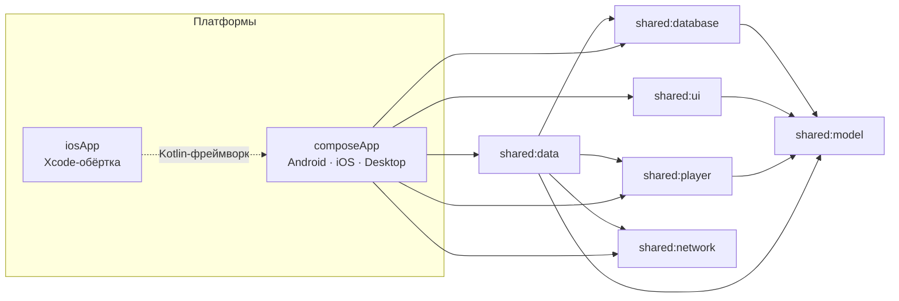

# Разработка Aniko

Эта страница — для тех, кто хочет собрать Aniko из исходников или разобраться в устройстве проекта.
Если вы просто хотите пользоваться приложением, вам нужен [README](../README.md).

Правила работы с кодом (git-флоу, конвенции, проверки) — в [`AGENTS.md`](../AGENTS.md). Описание используемого API Anixart — в [`docs/api/ANIXART_API.md`](api/ANIXART_API.md).

## Сборка из исходников

Требования: **JDK 17+**, Android SDK (для Android), **Xcode** (для iOS, только на macOS).
Gradle подтягивается автоматически (`./gradlew`).

```bash
# Android — debug APK
./gradlew :composeApp:assembleDebug
#   → composeApp/build/outputs/apk/debug/composeApp-debug.apk

# Desktop — запуск и DMG (macOS)
./gradlew :composeApp:run
./gradlew :composeApp:packageDmg
#   → composeApp/build/compose/binaries/main/dmg/

# iOS — открыть проект в Xcode (Gradle соберёт фреймворк автоматически)
open iosApp/iosApp.xcodeproj
```

<details>
<summary><b>Релизная подпись Android</b> (<code>assembleRelease</code>)</summary>

<br/>

Репозиторий не содержит ключей (см. `.gitignore`: `*.jks`, `keystore.properties`). Создайте свой:

```bash
cp keystore.properties.example keystore.properties
keytool -genkeypair -v -keystore composeApp/release/aniko-release.jks \
  -alias aniko-release -keyalg RSA -keysize 2048 -validity 10000
# заполните storePassword / keyPassword в keystore.properties
# (для PKCS12 они должны совпадать)

./gradlew :composeApp:assembleRelease
#   → composeApp/build/outputs/apk/release/composeApp-release.apk
```

В CI можно передать ключ переменными окружения `ANIKO_KEYSTORE_PATH`, `ANIKO_KEYSTORE_PASSWORD`,
`ANIKO_KEY_ALIAS`, `ANIKO_KEY_PASSWORD`. Без ключа релизная сборка падает на подписи — намеренно, а не
выпускается неподписанной.

Релизный пайплайн (`.github/workflows/release.yml`, триггер — push тега `v*`) собирает подписанный
APK, macOS DMG и неподписанный iOS IPA и создаёт **черновик** релиза в приватном репозитории с
заметками из секции версии в `CHANGELOG.md`. Keystore там хранится в GitHub Secrets как
`ANIKO_KEYSTORE_BASE64` (`base64 -i aniko-release.jks | pbcopy`) + три секрета с паролями/алиасом
выше. Тег обязан совпадать с `anikoAppVersion`, иначе джоб preflight падает.

</details>

<details>
<summary><b>Неподписанный .ipa для AltStore / SideStore</b></summary>

<br/>

```bash
xcodebuild archive -project iosApp/iosApp.xcodeproj -scheme iosApp -configuration Release \
  -archivePath build/Aniko.xcarchive -destination 'generic/platform=iOS' \
  CODE_SIGNING_ALLOWED=NO CODE_SIGNING_REQUIRED=NO CODE_SIGN_IDENTITY="" DEVELOPMENT_TEAM=""
mkdir -p Payload && cp -R build/Aniko.xcarchive/Products/Applications/Aniko.app Payload/
zip -qr Aniko-unsigned.ipa Payload
```

</details>

Desktop-версию можно запустить и напрямую: `./gradlew :composeApp:run` (проверено на macOS; Windows и Linux не тестировались).

## Архитектура


```mermaid
graph LR
    subgraph Платформы
        A[composeApp<br/>Android · iOS · Desktop]
        X[iosApp<br/>Xcode-обёртка]
    end
    A --> D[shared:data]
    A --> UI[shared:ui]
    A --> P[shared:player]
    A --> DB[shared:database]
    A --> N[shared:network]
    D --> N
    D --> DB
    D --> P
    D --> M[shared:model]
    P --> M
    UI --> M
    DB --> M
    X -.->|Kotlin-фреймворк| A
```

| Слой | Что внутри |
|---|---|
| `shared:model` | Доменные модели |
| `shared:network` | HTTP-клиент, конфигурация API, типизированные ошибки |
| `shared:data` | Репозитории, DTO, API-интерфейсы, офлайн-очередь и синхронизация |
| `shared:database` | SQLDelight: TTL-кэш, членство в списках, прогресс серий |
| `shared:player` | Плеер: WebView-мост (Android/iOS) и VLC-рендер (Desktop) |
| `shared:ui` | Дизайн-система, компоненты, темы, RU/EN i18n |
| `composeApp` | Экраны, навигация, MVI-ViewModel, точки входа платформ |
| `detekt-rules` | Кастомные правила линтера (например, запрет кириллицы вне i18n) |

**Стек:** Kotlin 2.4 · Compose Multiplatform 1.11 · Ktor 3.5 · Koin 4.2 · SQLDelight 2.3 · Coil 3.5 ·
vlcj 4.11 (Desktop). Архитектура экранов — MVI (`BaseViewModel<State, Intent, Effect>`).

Полное описание используемого API Anixart (эндпоинты, модели, авторизация) —
[`docs/api/ANIXART_API.md`](api/ANIXART_API.md).

## Обновление из приложения

Приложение само узнаёт о новых версиях из **GitHub Releases** публичного репозитория и предлагает
обновиться. Проверка идёт при запуске (не чаще раза в сутки, только внутри сессии) и по кнопке
«Проверить обновления» в настройках; при находке показывается диалог с «Что нового», кнопками
«Обновить» / «Позже» / «Пропустить эту версию».

| Платформа | Что делает «Обновить» |
|---|---|
| Android | Скачивает APK, проверяет SHA-256, запускает системную установку (`PackageInstaller`); обновление ставится поверх. При первом запуске система попросит разрешить Aniko устанавливать приложения. |
| macOS | Скачивает DMG, проверяет SHA-256, заменяет `Aniko.app` новой версией и перезапускает приложение. Если приложение запущено не из `.app` или каталог недоступен для записи — открывает страницу релиза. |
| iOS | Обновить себя не может (неподписанная side-load сборка): показывает версию и открывает страницу релиза с инструкцией. |

Как это устроено:

- Код — в `shared/data/.../update` (`UpdateChecker`, `GitHubReleaseSource`, `UpdateDownloader`,
  `UpdateCoordinator`, `AppVersion`), интерфейс — в `composeApp/.../feature/update` (`UpdateHost`,
  `UpdateDialog`, `UpdateSettingsItem`), платформенная часть — реализации `AppUpdateInstaller`
  в `PlatformModule`.
- Источник — **список** релизов (`GET /repos/ArkHak/Aniko-app/releases`), а не `/releases/latest`:
  последний не возвращает pre-release, а все релизы `0.x` помечены как pre-release. Берётся
  максимальная по SemVer версия; версию ≤ текущей приложение не предлагает. Запросы идут без
  токена (лимит GitHub — 60 в час на IP); пока репозиторий приватный, ответ 404 трактуется как
  «обновлений нет».
- Токен сессии Anixart на GitHub **не отправляется**: для обновлений используется отдельный
  HTTP-клиент (`createUpdateHttpClient`) без `AnixTokenPlugin`.
- Безопасность: только `https` и хосты GitHub (`github.com`, `api.github.com`,
  `*.githubusercontent.com`, проверяется и конечный адрес после редиректов); файл сначала
  скачивается в `*.part`, сверяется по SHA-256 из `SHA256SUMS.txt` того же релиза и только потом
  получает настоящее имя; при несовпадении удаляется. На Android подлинность дополнительно
  обеспечивает подпись APK: система не поставит обновление с другим ключом.

### Что должно быть в каждом релизе

Иначе автообновление пропустит платформу или откажется ставить файл:

- Ассеты с точными именами: `aniko-vX.Y.Z-android.apk`, `aniko-vX.Y.Z-macos.dmg`,
  `aniko-vX.Y.Z-ios-unsigned.ipa` и `SHA256SUMS.txt` (формат `sha256sum`: `<хэш>  <имя файла>` — его
  делает `shasum -a 256 aniko-*`).
- Тег `vX.Y.Z` по SemVer (`v0.2.0`, `v1.0.0-beta.1`); черновики (`draft`) приложение игнорирует.
- В release notes **первая секция второго уровня** (`## Что нового …`) — именно она показывается в
  диалоге обновления (без таблиц, ссылок и разметки); всё остальное остаётся на странице релиза.
- Версия приложения (`anikoAppVersion`) должна совпадать с тегом; `versionCode` Android — строго
  больше предыдущего.

## Тесты и качество

```bash
./gradlew ktlintCheck detektMetadataCommonMain detektDesktopMain   # линтеры
./gradlew :composeApp:desktopTest :shared:data:desktopTest         # тесты
```

В репозитории есть контрактные тесты на сэмплах ответов API, UI smoke-тесты на Desktop, аудиты
доступности (контраст WCAG AA, `contentDescription`, масштаб шрифта 200%) и проверка на TalkBack.
