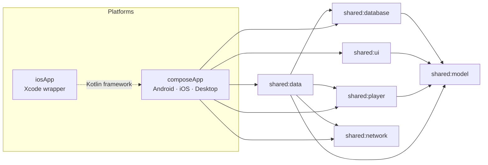

# Aniko development

This page is for those who want to build Aniko from source or understand how the project is put together.
If you just want to use the app, you need the [README](../README_EN.md).

Coding rules (git flow, conventions, checks) are in [`AGENTS.md`](../AGENTS.md). The description of the Anixart API in use is in [`docs/api/ANIXART_API.md`](api/ANIXART_API.md) (in Russian).

## Build from source

Requirements: **JDK 17+**, Android SDK (for Android), **Xcode** (for iOS, macOS only).
Gradle is fetched automatically (`./gradlew`).

```bash
# Android — debug APK
./gradlew :composeApp:assembleDebug
#   → composeApp/build/outputs/apk/debug/composeApp-debug.apk

# Desktop — run and build a DMG (macOS)
./gradlew :composeApp:run
./gradlew :composeApp:packageDmg
#   → composeApp/build/compose/binaries/main/dmg/

# iOS — open the project in Xcode (Gradle builds the framework automatically)
open iosApp/iosApp.xcodeproj
```

<details>
<summary><b>Android release signing</b> (<code>assembleRelease</code>)</summary>

<br/>

The repository contains no keys (see `.gitignore`: `*.jks`, `keystore.properties`). Create your own:

```bash
cp keystore.properties.example keystore.properties
keytool -genkeypair -v -keystore composeApp/release/aniko-release.jks \
  -alias aniko-release -keyalg RSA -keysize 2048 -validity 10000
# fill in storePassword / keyPassword in keystore.properties
# (they must match for PKCS12)

./gradlew :composeApp:assembleRelease
#   → composeApp/build/outputs/apk/release/composeApp-release.apk
```

In CI you can pass the key through the environment variables `ANIKO_KEYSTORE_PATH`,
`ANIKO_KEYSTORE_PASSWORD`, `ANIKO_KEY_ALIAS`, `ANIKO_KEY_PASSWORD`. Without a key the release build
fails at the signing step — on purpose, rather than shipping an unsigned build.

</details>

<details>
<summary><b>Unsigned .ipa for AltStore / SideStore</b></summary>

<br/>

```bash
xcodebuild archive -project iosApp/iosApp.xcodeproj -scheme iosApp -configuration Release \
  -archivePath build/Aniko.xcarchive -destination 'generic/platform=iOS' \
  CODE_SIGNING_ALLOWED=NO CODE_SIGNING_REQUIRED=NO CODE_SIGN_IDENTITY="" DEVELOPMENT_TEAM=""
mkdir -p Payload && cp -R build/Aniko.xcarchive/Products/Applications/Aniko.app Payload/
zip -qr Aniko-unsigned.ipa Payload
```

</details>

The Desktop version can also be started directly: `./gradlew :composeApp:run` (tested on macOS; Windows and Linux are untested).

## Architecture



| Layer | What's inside |
|---|---|
| `shared:model` | Domain models |
| `shared:network` | HTTP client, API configuration, typed errors |
| `shared:data` | Repositories, DTOs, API interfaces, offline queue and sync |
| `shared:database` | SQLDelight: TTL cache, list membership, episode progress |
| `shared:player` | Player: WebView bridge (Android/iOS) and VLC rendering (Desktop) |
| `shared:ui` | Design system, components, themes, RU/EN i18n |
| `composeApp` | Screens, navigation, MVI view models, platform entry points |
| `detekt-rules` | Custom linter rules (e.g. no Cyrillic literals outside the i18n layer) |

**Stack:** Kotlin 2.4 · Compose Multiplatform 1.11 · Ktor 3.5 · Koin 4.2 · SQLDelight 2.3 · Coil 3.5 ·
vlcj 4.11 (Desktop). Screen architecture is MVI (`BaseViewModel<State, Intent, Effect>`).

The full description of the Anixart API in use (endpoints, models, authentication) is in
[`docs/api/ANIXART_API.md`](api/ANIXART_API.md) (in Russian).

## Tests & quality

```bash
./gradlew ktlintCheck detektMetadataCommonMain detektDesktopMain   # linters
./gradlew :composeApp:desktopTest :shared:data:desktopTest         # tests
```

The repository has contract tests against real API response samples, Desktop UI smoke tests,
accessibility audits (WCAG AA contrast, `contentDescription`, 200% font scale) and a TalkBack pass.
