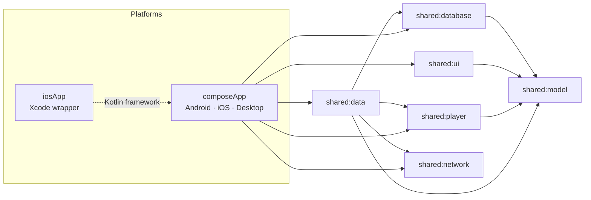

# Aniko development

This page is for those who want to build Aniko from source or understand how the project is put together.
If you just want to use the app, you need the [README](../README_EN.md).

Coding rules (git flow, conventions, checks) are in [`AGENTS.md`](../AGENTS.md). The description of the Anixart API in use is in [`docs/api/ANIXART_API.md`](api/ANIXART_API.md) (in Russian).

## Build from source

Requirements: **JDK 17+**, Android SDK (for Android), **Xcode** (for iOS, macOS only).
Gradle is fetched automatically (`./gradlew`).

```bash
# Android — debug APK
./gradlew :composeApp:assembleDebug
#   → composeApp/build/outputs/apk/debug/composeApp-debug.apk

# Desktop — run and build a DMG (macOS)
./gradlew :composeApp:run
./gradlew :composeApp:packageDmg
#   → composeApp/build/compose/binaries/main/dmg/

# iOS — open the project in Xcode (Gradle builds the framework automatically)
open iosApp/iosApp.xcodeproj
```

<details>
<summary><b>Android release signing</b> (<code>assembleRelease</code>)</summary>

<br/>

The repository contains no keys (see `.gitignore`: `*.jks`, `keystore.properties`). Create your own:

```bash
cp keystore.properties.example keystore.properties
keytool -genkeypair -v -keystore composeApp/release/aniko-release.jks \
  -alias aniko-release -keyalg RSA -keysize 2048 -validity 10000
# fill in storePassword / keyPassword in keystore.properties
# (they must match for PKCS12)

./gradlew :composeApp:assembleRelease
#   → composeApp/build/outputs/apk/release/composeApp-release.apk
```

In CI you can pass the key through the environment variables `ANIKO_KEYSTORE_PATH`,
`ANIKO_KEYSTORE_PASSWORD`, `ANIKO_KEY_ALIAS`, `ANIKO_KEY_PASSWORD`. Without a key the release build
fails at the signing step — on purpose, rather than shipping an unsigned build.

The release pipeline (`.github/workflows/release.yml`, triggered by pushing a `v*` tag) builds the
signed APK, the macOS DMG and the unsigned iOS IPA, and creates a **draft** release with notes taken
from the version's section in `CHANGELOG.md`. The keystore is stored in GitHub Secrets as
`ANIKO_KEYSTORE_BASE64` (`base64 -i aniko-release.jks | pbcopy`) plus the three password/alias
secrets above. The tag must match `anikoAppVersion`, otherwise the preflight job fails.

</details>

<details>
<summary><b>Unsigned .ipa for AltStore / SideStore</b></summary>

<br/>

```bash
xcodebuild archive -project iosApp/iosApp.xcodeproj -scheme iosApp -configuration Release \
  -archivePath build/Aniko.xcarchive -destination 'generic/platform=iOS' \
  CODE_SIGNING_ALLOWED=NO CODE_SIGNING_REQUIRED=NO CODE_SIGN_IDENTITY="" DEVELOPMENT_TEAM=""
mkdir -p Payload && cp -R build/Aniko.xcarchive/Products/Applications/Aniko.app Payload/
zip -qr Aniko-unsigned.ipa Payload
```

</details>

The Desktop version can also be started directly: `./gradlew :composeApp:run` (tested on macOS; Windows and Linux are untested).

## Architecture


```mermaid
graph LR
    subgraph Platforms
        A[composeApp<br/>Android · iOS · Desktop]
        X[iosApp<br/>Xcode wrapper]
    end
    A --> D[shared:data]
    A --> UI[shared:ui]
    A --> P[shared:player]
    A --> DB[shared:database]
    A --> N[shared:network]
    D --> N
    D --> DB
    D --> P
    D --> M[shared:model]
    P --> M
    UI --> M
    DB --> M
    X -.->|Kotlin framework| A
```

| Layer | What's inside |
|---|---|
| `shared:model` | Domain models |
| `shared:network` | HTTP client, API configuration, typed errors |
| `shared:data` | Repositories, DTOs, API interfaces, offline queue and sync |
| `shared:database` | SQLDelight: TTL cache, list membership, episode progress |
| `shared:player` | Player: WebView bridge (Android/iOS) and VLC rendering (Desktop) |
| `shared:ui` | Design system, components, themes, RU/EN i18n |
| `composeApp` | Screens, navigation, MVI view models, platform entry points |
| `detekt-rules` | Custom linter rules (e.g. no Cyrillic literals outside the i18n layer) |

**Stack:** Kotlin 2.4 · Compose Multiplatform 1.11 · Ktor 3.5 · Koin 4.2 · SQLDelight 2.3 · Coil 3.5 ·
vlcj 4.11 (Desktop). Screen architecture is MVI (`BaseViewModel<State, Intent, Effect>`).

The full description of the Anixart API in use (endpoints, models, authentication) is in
[`docs/api/ANIXART_API.md`](api/ANIXART_API.md) (in Russian).

## In-app updates

The app finds new versions on its own from the **GitHub Releases** of the public repository and offers to
update. It checks at launch (at most once a day, only inside a session) and from the "Check for updates" row in
Settings; when a version is found, a dialog shows "What's new" with "Update" / "Later" / "Skip this version".

| Platform | What "Update" does |
|---|---|
| Android | Downloads the APK, verifies SHA-256, starts the system installer (`PackageInstaller`); the update installs over the current app. On first use the system asks to allow Aniko to install apps. |
| macOS | Downloads the DMG, verifies SHA-256, replaces `Aniko.app` with the new version and restarts the app. If the app is not run from an `.app` or the folder is not writable, it opens the release page. |
| iOS | Cannot update itself (unsigned side-loaded build): shows the version and opens the release page with instructions. |

How it works:

- Code: `shared/data/.../update` (`UpdateChecker`, `GitHubReleaseSource`, `UpdateDownloader`,
  `UpdateCoordinator`, `AppVersion`); UI: `composeApp/.../feature/update` (`UpdateHost`, `UpdateDialog`,
  `UpdateSettingsItem`); platform part: `AppUpdateInstaller` implementations registered in `PlatformModule`.
- The source is the **list** of releases (`GET /repos/ArkHak/Aniko-app/releases`), not `/releases/latest`: the latter
  skips pre-releases and all `0.x` releases are pre-releases. The highest SemVer version wins; a version ≤ the
  current one is never offered. Requests are unauthenticated (GitHub limit: 60/hour per IP); while the repository
  is private the 404 answer is treated as "no updates".
- The Anixart session token is **never** sent to GitHub: updates use a separate HTTP client
  (`createUpdateHttpClient`) without `AnixTokenPlugin`.
- Security: `https` and GitHub hosts only (`github.com`, `api.github.com`, `*.githubusercontent.com`, also checked
  for the final URL after redirects); the file is downloaded to `*.part`, verified against the SHA-256 from the same
  release's `SHA256SUMS.txt` and only then gets its real name; on mismatch it is deleted. On Android the APK signature
  adds authenticity: the system will not install an update signed with a different key.

### What every release must contain

Otherwise auto-update skips the platform or refuses to install the file:

- Assets with exact names: `aniko-vX.Y.Z-android.apk`, `aniko-vX.Y.Z-macos.dmg`, `aniko-vX.Y.Z-ios-unsigned.ipa`
  and `SHA256SUMS.txt` (`sha256sum` format: `<hash>  <file name>` — produced by `shasum -a 256 aniko-*`).
- A SemVer tag `vX.Y.Z` (`v0.2.0`, `v1.0.0-beta.1`); drafts are ignored.
- In the release notes the **first level-2 section** (`## What's new …`) is what the update dialog shows (without
  tables, links and markup); everything else stays on the release page.
- The app version (`anikoAppVersion`) must equal the tag; the Android `versionCode` must strictly increase.

## Tests & quality

```bash
./gradlew ktlintCheck detektMetadataCommonMain detektDesktopMain   # linters
./gradlew :composeApp:desktopTest :shared:data:desktopTest         # tests
```

The repository has contract tests against real API response samples, Desktop UI smoke tests,
accessibility audits (WCAG AA contrast, `contentDescription`, 200% font scale) and a TalkBack pass.
